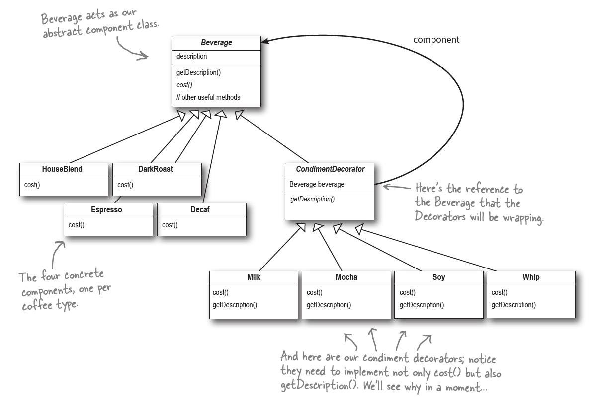

* Decorator
    * **Definition:** Attaches additional responsibilities to an object dynamically. Decorator provides a flexible alternative to subclassing for extending functionality.

    * **Class Diagram:**
      

    * **OO Principles:**
        * Encapsulate what varies (Identify aspect of your application that vary separate from what stay the same)
        * Favor composition over inheritance
        * Program to interface, not implementations
        * Strive for loosely coupled designs between objects that interact.
        * **_Classes should be open for extension but closed for modification._**

    * **Questions that help to verify what I understood:**
        * What is intent of Decorator pattern?
        * Are Decorators static or dynamic (means binding at runtime)? How?
        * Why decorators has the same super-type with object being decorator?
        * What is role of the inheritance and composition in the Decorator pattern? Explain
        * What is the downside of Decorator pattern?