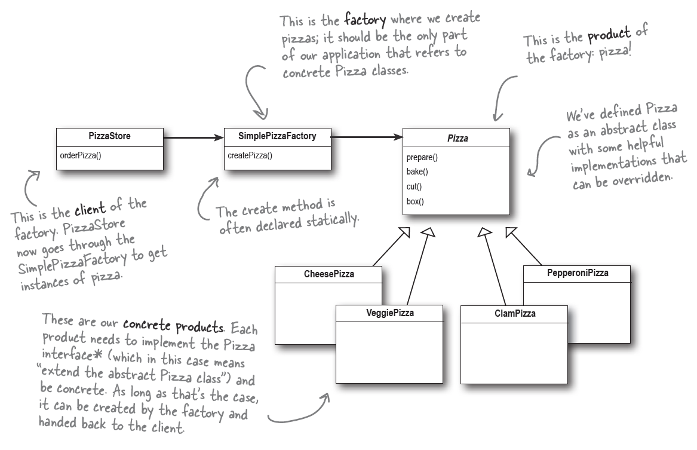
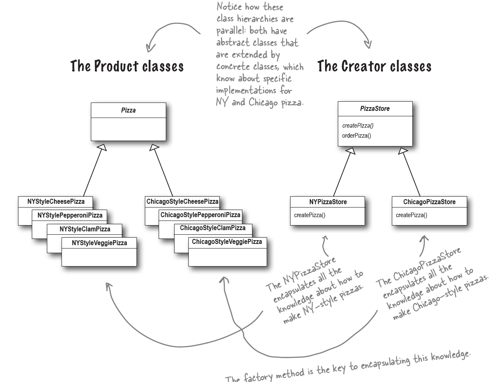
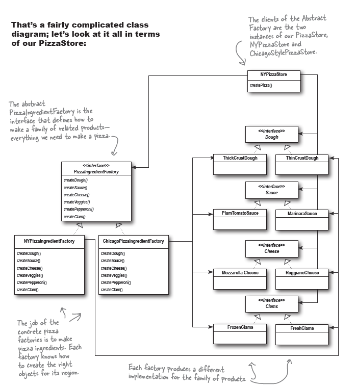

* Factory
  * **Simple Factory:**
    * **The Simple Factory:** isn’t actually a Design Pattern
    * **Class Diagram:**
    
  * **Factory Method:** 
    * **Definition:** defines an interface for creating object. But lets the subclasses decide which classes to instantiate. It lets a class defer instantiation to the subclasses.
    * **Class Diagram:**
    
      
  * **Abstract Factory:**
    * **Definition:** provides an interface for creating a family of related or dependent objects without specifying their concrete classes
    * **Class Diagram:**
    

* **OO Principles:**
    * Encapsulate what varies (Identify aspect of your application that vary separate from what stay the same)
    * Favor composition over inheritance
    * Program to interface, not implementations
    * Strive for loosely coupled designs between objects that interact.
    * Classes should be open for extension but closed for modification.
    * **_Depend on abstractions. Do not depend on concrete classes._**

* **Questions that help to verify what I understood:**
    * What is intent of Factory method pattern?
    * What is intent of Abstract factory pattern?
    * How does the Factory method pattern uses polymorphism?
    * How does the Abstract  factory pattern uses polymorphism?
    * What is the differences between Factory method and Abstract factory pattern?