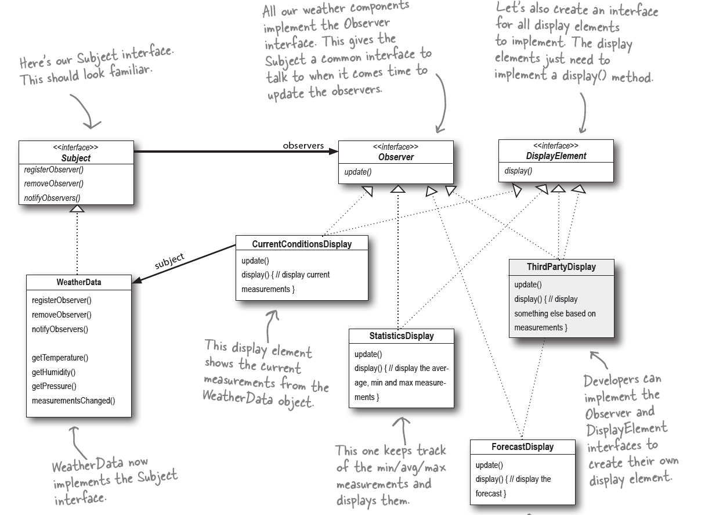

* Observer
    * **Definition:** defines a one-to-many dependency between objects so that when one object changes state, all its dependents are notified and updated automatically
  
    * **Class Diagram:**
      
  
    * **OO Principles:**
        * Encapsulate what varies (Identify aspect of your application that vary separate from what stay the same)
        * Favor composition over inheritance
        * Program to interface, not implementations
        * _**Strive for loosely coupled designs between objects that interact.**_
  
    * **Questions that help to verify what I understood:**
        * What is intent of Observer pattern? And how the design pattern accomplish it
        * What is the Push model of Observer pattern? What is benefits(s) and cost(s)
        * What is the Pull model of Observer pattern? What is benefit(s) and cost(s)
        * In java Observer pattern, what are 2 base types that are not interface? What and why does it impact to?
        * What is the issue of coupling in Observer pattern? How the pattern solve it?