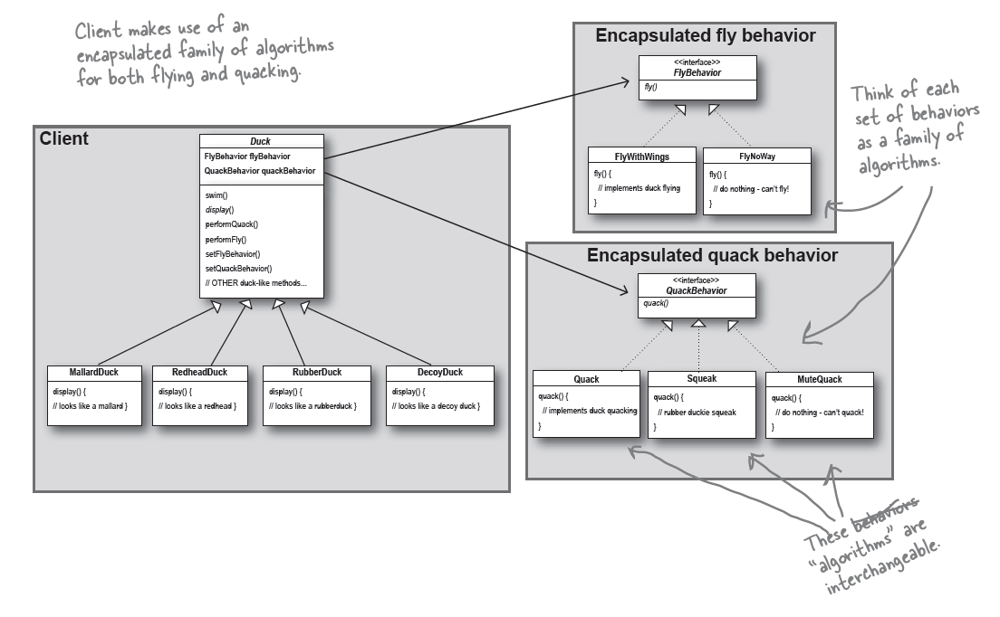

* Strategy
  * **Definition:** defines a family of algorithms, encapsulates each one, and makes them interchangeable. It lets the algorithm vary independently from clients that use it.
  * **Class Diagram:**
    
  * **OO Principles:**
    * Encapsulate what varies (Identify aspect of your application that vary separate from what stay the same)
    * Favor composition over inheritance
    * Program to interface, not implementations
  * **Questions that help to verify what I understood:**
    * What is intent of Strategy pattern?
    * Where is VOD (Variable Oriented Design) used in Strategy pattern?
    * Where is the polymorphism used in the Strategy pattern and benefits?
    * What is importance of role of the context (client) object?
    * What is 3 OO Principles and how they achieve in Strategy pattern?